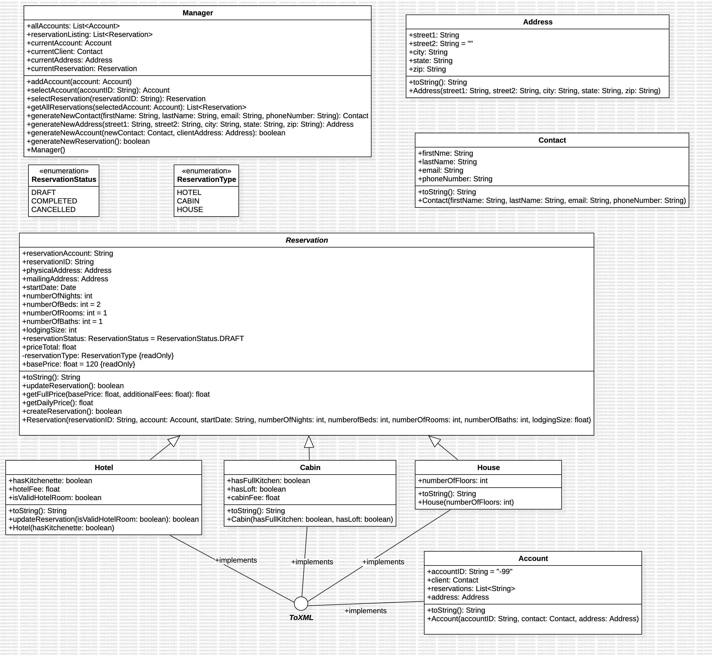

# SWEN 646 Assignments
## Week 2 Assignment
Create software model for Accomodation Reservation System

## Week 3 Assignment
Create polymorphism, inheritence, and constructors for model

## Week 4 Assignment
Access Modifiers, encapsulation, overloading and overriding

## Week 5 Assignment
Add Exceptions
